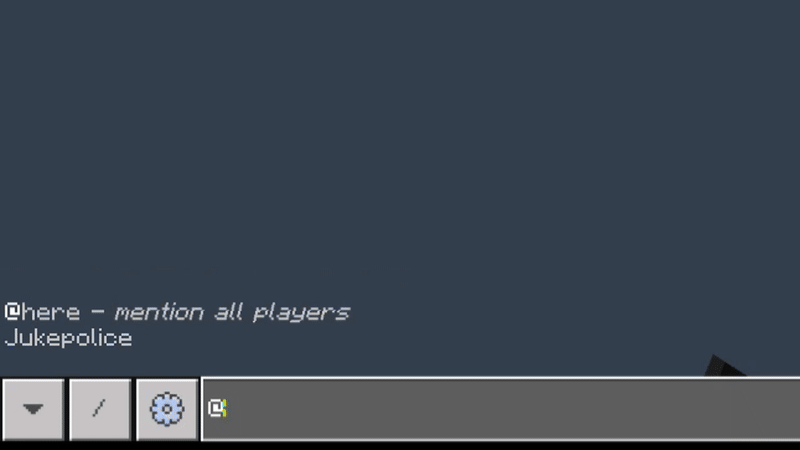

# 🧠 Gaben – Minecraft Bedrock LLM Assistant

Gaben is a powerful in-game assistant for **Minecraft Bedrock Edition**, powered by a locally hosted LLM via [Ollama](https://ollama.com/). Just type `@gaben` in chat, and he’ll respond with information you provide him. Useful for new players wanting to learn about your server!



> 🔧 Built by [Jukepolice](https://github.com/Jukepolice)

---

## 🎮 Features

- 🗣️ **@gaben**: Mention Gaben in Minecraft chat and ask anything, prepacked with info from how to tame a wolf to finding diamonds.
- 🧠 **LLM-Powered**: Integrates with local models like `gemma3` using the Ollama API, giving you control over how powerful the model is.
- 📚 **Customizable Knowledge Base**: Gaben includes a simple, editable JSON file (`gaben_knowledge.json`) that lets server owners define responses to common questions.
- 🔌 **Local Flask API**: Lightweight Python backend for chat request handling.
- 🔗 **Minecraft Script Integration**: Uses `@minecraft/server` and `@minecraft/server-net` to connect the game to the AI.

---

## 📦 Installation

### 1. Requirements

- Minecraft Bedrock (v1.21.80+)
- Python 3.10+
- [Ollama](https://ollama.com) with a supported model installed (`gemma3`, `llama3`, etc.)

---

### 2. Setup

#### 🔁 Step 1: Clone the Repo

```bash
git clone https://github.com/jukepolice/bedrock-chat-llm.git
cd gaben-bedrock-assistant
````

#### 🧠 Step 2: Install Python Dependencies

```bash
pip install flask
```

> Make sure our API is running and a model like `gemma3` is available.

#### 🚀 Step 3: Start the API

```bash
python main.py
```

This will start the Flask server at `http://localhost:9595`.

---

### 📜 3. Minecraft Behavior Pack

Include the provided behavior pack in your Minecraft world:

* Place the `bp_gabenLLM` folder inside your server's `development_behavior_packs/`
* Enable the behavior pack in your world settings, as well as beta API's
* Start the world!

---

## 💬 Usage

Just join the world and type:

```
@gaben how do I find diamonds?
```

Gaben will respond with a short, friendly answer based on game knowledge or your chosen language model.

---

## 🧠 Customizing Gaben

You can define your own common Q\&A pairs in `gaben_knowledge.json`. This allows your server to have personalized responses, custom tips, or helpful guidance for your players.

Example entry:

```json
{
  "question_keywords": ["how to donate", "support the server", "donation perks"],
  "answer": "Visit playmyserver.com/donate to support and unlock perks!"
}
```

If no keyword matches, Gaben will fall back to the LLM to generate a helpful reply.

---

## 🤝 Credits

* Developed by [Jukepolice](https://github.com/Jukepolice)
* Powered by [Ollama](https://ollama.com)

---

## 📜 License

MIT License - free to use, modify, and distribute.


